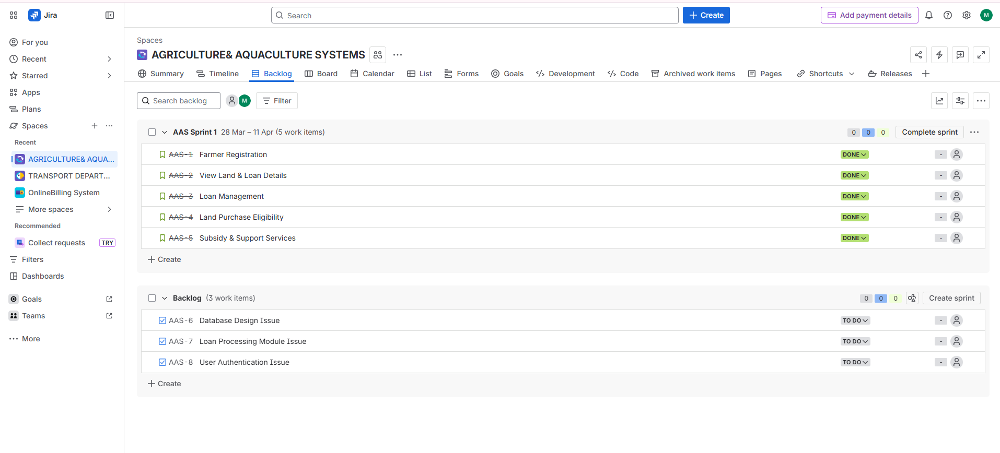
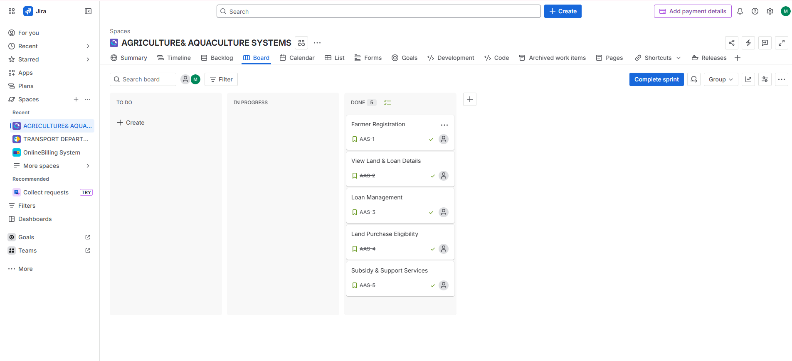
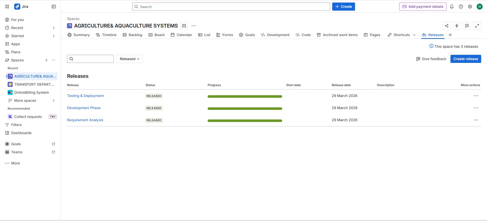
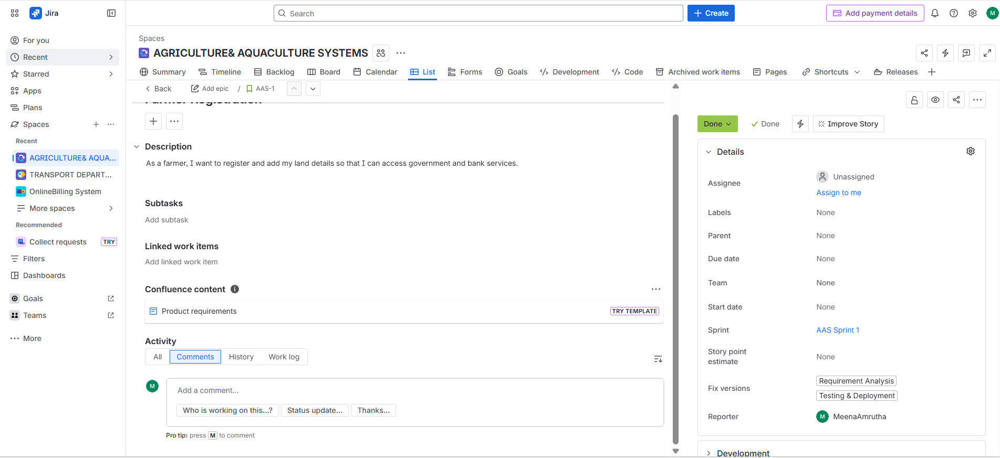

# agriculture-aquaculture-system
A system to manage farmer data, land records, loan processing, and government services for agriculture and aquaculture.

**Agriculture & Aquaculture System (AAS)**
**Project Description**
A system developed to manage farmer data, land records, loan processing, and government support services for agriculture and aquaculture.

**Users**
* Farmers
* Bank Officials
* Government Officials
* Guests

**Features**
* Farmer Registration
* Land Details Management
* Loan Processing & Updates
* Land Purchase Eligibility Check
* Subsidy & Insurance Management

**User Stories**
1. Farmer Registration
2. View Land & Loan Details
3. Loan Management
4. Land Purchase Eligibility
5. Subsidy & Support Services

**Issues**
* Database Design
* Loan Module
* Authentication System

---

**Milestones**
* Requirement Analysis
* Development Phase
* Testing & Deployment

**Sprints**
* Sprint 1: Registration & Viewing
* Sprint 2: Loan & Purchase
* Sprint 3: Subsidy & Testing

**Modules**
* Farmer Module
* Land Management Module
* Loan Management Module
* Government Services Module

**Technologies Used**
* Frontend: HTML, CSS
* Backend: (Python / Java / Node.js)
* Database: MySQL

**Workflow**
Farmer → Bank → Government → Subsidy/Loan Processing → Land Transactions

**Screenshots**
**Backlog**

**Board**

**Milestones**

**User Stories**

**Author**

N.MeenaAmrutha

**GitHub Repository**
https://github.com/2300030461/agriculture-aquaculture-system
